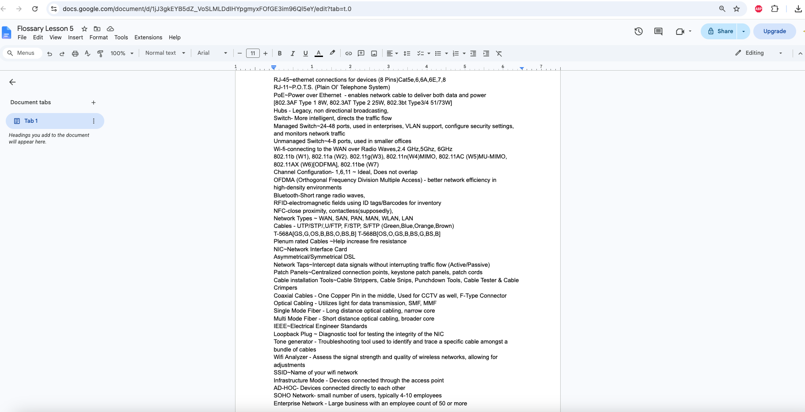
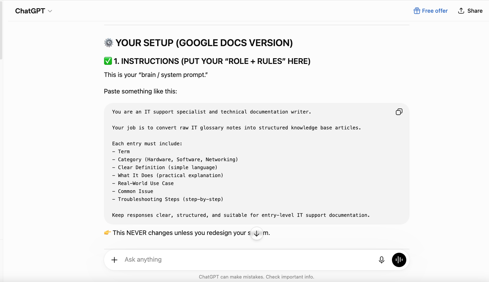
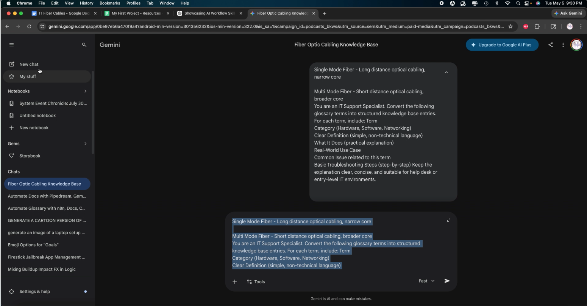
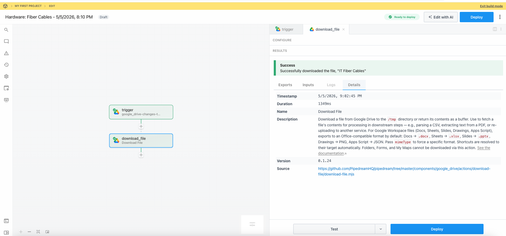
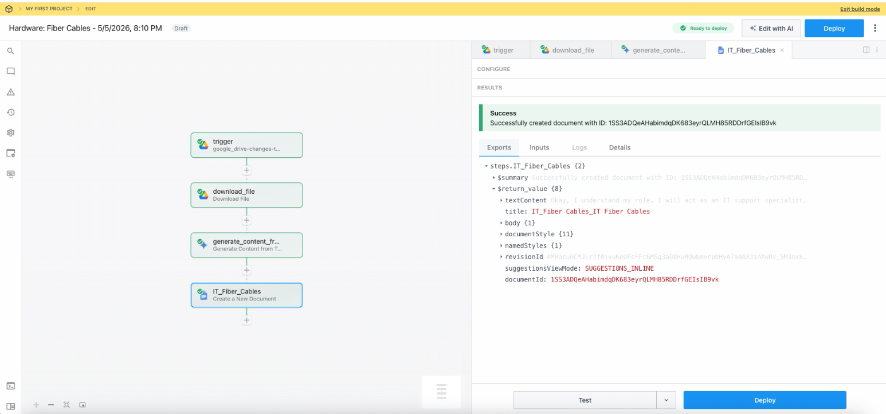
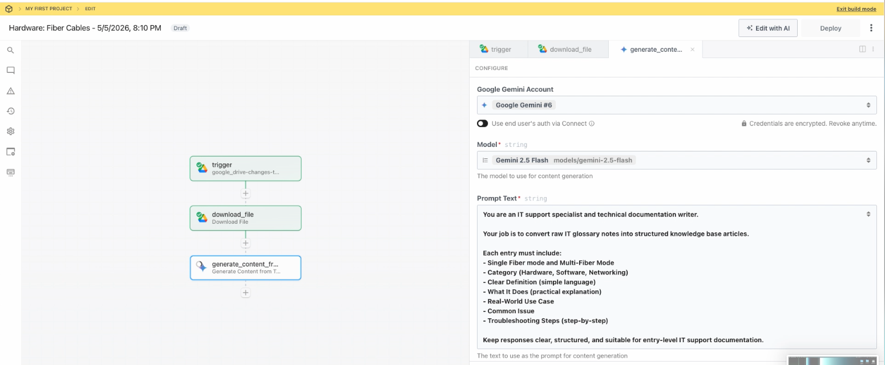
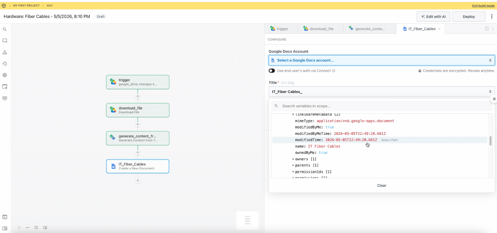
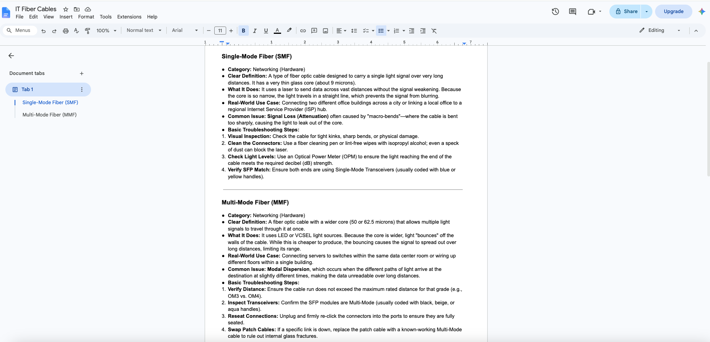

# workflow-ai-automation-pipeline
AI-assisted workflow automation pipeline using Google Docs, Pipedream, and Gemini to transform technical notes into structured knowledge base documentation.

# AI Workflow Automation Pipeline

## Overview

Built an automated knowledge base documentation workflow using Google Docs, Pipedream, and AI tools to transform raw technical notes into structured documentation.

This project explores how automation and AI can improve documentation workflows for IT support and technical teams.

---

## Project Goal

The goal was to reduce manual documentation tasks by creating a workflow that organizes technical information into consistent knowledge base formats.

---

## Tools Used

- Google Docs
- Pipedream
- Gemini AI
- Workflow Automation
- Documentation Management
- AI-Assisted Content Processing

---

## Workflow Process

1. Technical notes are collected in Google Docs.
2. Pipedream triggers the automation workflow.
3. AI processes and structures the information.
4. Content is formatted into knowledge base documentation.
5. Final documentation is organized for future reference.

---

## Project Screenshots

### Workflow Overview

### Pipedream Workflow

### Documentation Output

---

## Skills Demonstrated

- Workflow Automation
- AI Integration
- Technical Documentation
- Process Improvement
- Knowledge Management
- Problem Solving

---

## Future Improvements

- Connect additional APIs
- Add automated publishing
- Expand documentation templates
- Integrate ticketing systems
